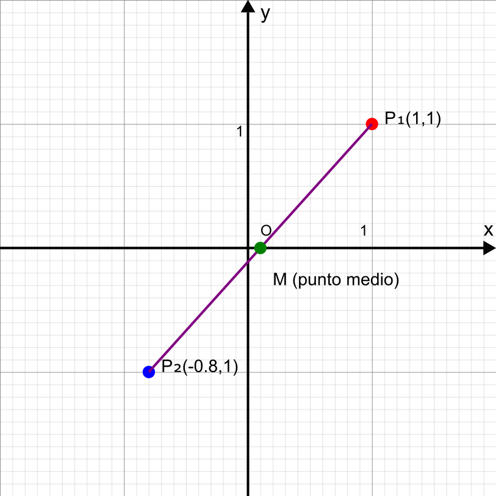
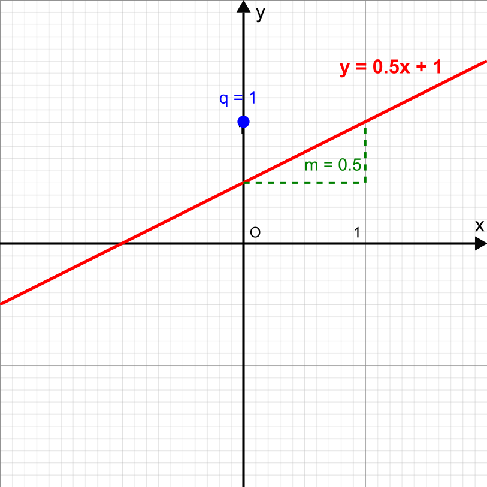
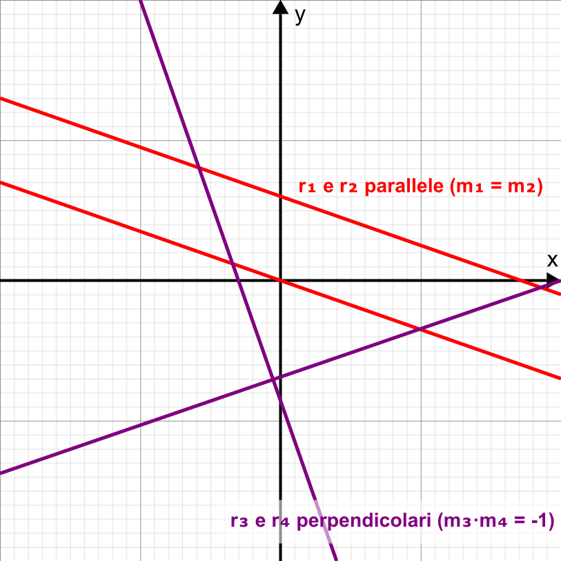
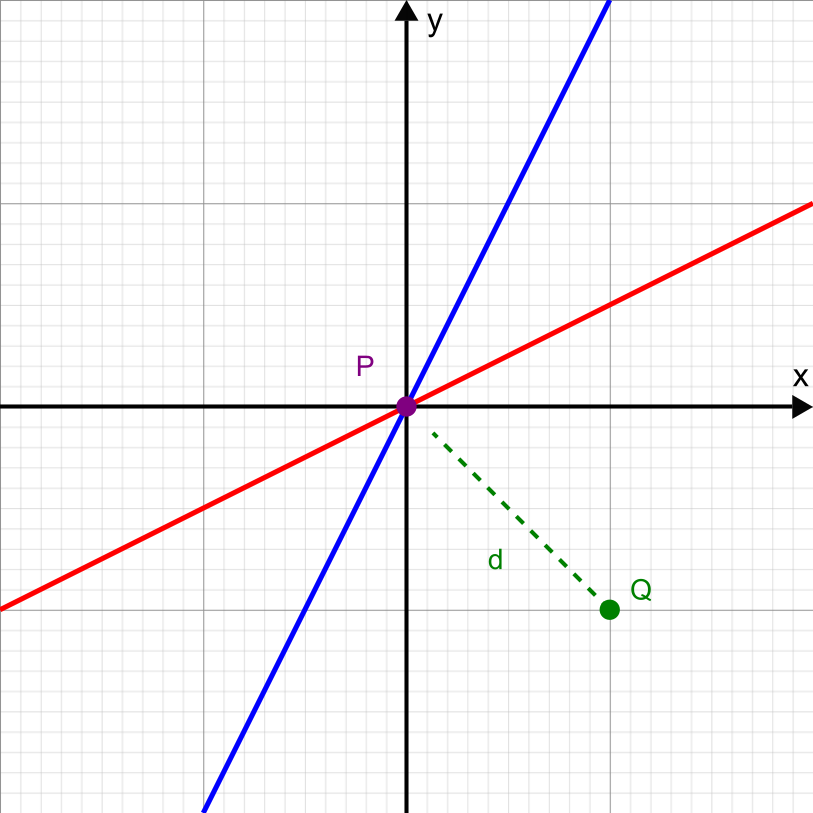
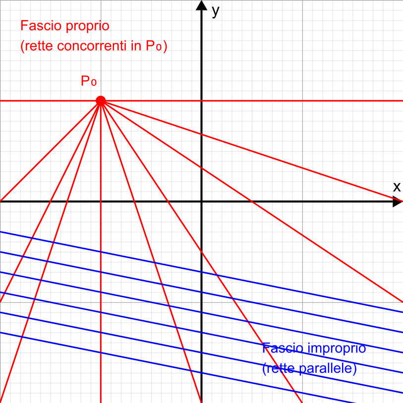
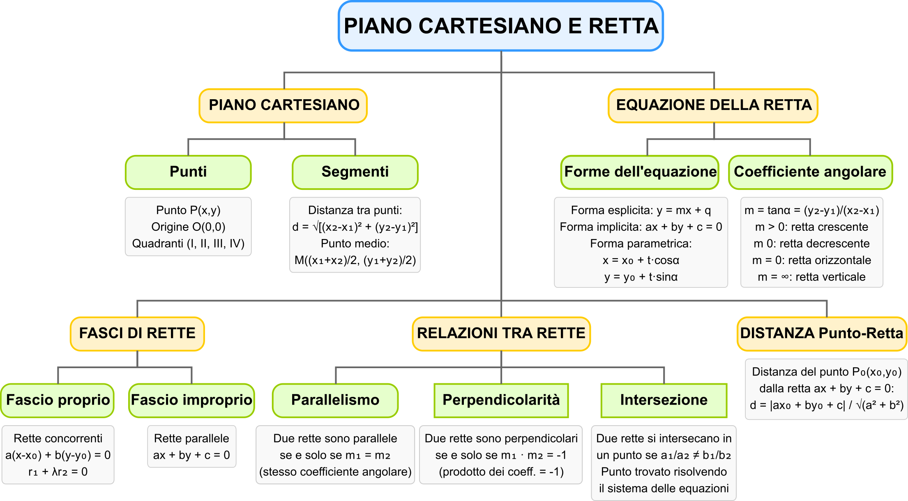

# 📈 Il Piano Cartesiano e la Retta

## 🔵 Punti e segmenti nel piano cartesiano

Il piano cartesiano è formato da due assi perpendicolari: l'asse x (orizzontale) e l'asse y (verticale). Ogni punto P nel piano è identificato da una coppia ordinata di coordinate (x, y).

- **Punto**: Un punto P(x, y) rappresenta una posizione precisa nel piano
- **Distanza tra due punti**: Se abbiamo P₁(x₁, y₁) e P₂(x₂, y₂), la distanza tra loro è: $$d=\sqrt{(x_2-x_1)^2+(y_2-y_1)^2}$$
- **Punto medio**: Il punto medio del segmento P₁P₂ ha coordinate $$ (\dfrac{(x₁+x₂)}{2}, \dfrac{(y₁+y₂)}{2}) $$

## 🟰 Caratteristiche dell'equazione di una retta

Una retta nel piano cartesiano può essere rappresentata in diverse forme:

1. **Forma esplicita**: y = mx + q
   - m: coefficiente angolare (pendenza)
   - q: termine noto (intercetta con l'asse y) 

2. **Forma implicita**: ax + by + c = 0
   - Se b ≠ 0, possiamo ricavare la forma esplicita: $$ y= -\dfrac{a}{b}x -\dfrac{c}{b} $$
   - Se b = 0, otteniamo $$x = -\dfrac{c}{a}$$ (retta parallela all'asse y)

3. **Forma parametrica**:$$x = x₀ + t·cosα$$ $$y = y₀ + t·sinα$$

   - (x₀, y₀) è un punto della retta
   - α è l'angolo che la retta forma con l'asse x
   - t è il parametro

## // Il coefficiente angolare e le relazioni di parallelismo e perpendicolarità

- **Coefficiente angolare (m)**: Rappresenta la pendenza della retta e corrisponde alla tangente dell'angolo che la retta forma con l'asse x positivo
  - m = tanα = (y₂-y₁)/(x₂-x₁) per due punti P₁ e P₂ sulla retta
  - m > 0: retta crescente
  - m < 0: retta decrescente
  - m = 0: retta orizzontale (parallela all'asse x)
  - m non definito: retta verticale (parallela all'asse y)

- **Relazioni tra rette**:
  - Due rette con coefficienti angolari m₁ e m₂ sono **parallele** se e solo se m₁ = m₂
  - Due rette sono **perpendicolari** se e solo se m₁ · m₂ = -1 (quando entrambi i coefficienti sono definiti)

## ✏️ Scrittura di un'equazione della retta

Si può determinare l'equazione di una retta in vari modi:

1. **Dati due punti** P₁(x₁, y₁) e P₂(x₂, y₂):
   - Calcolo il coefficiente angolare: m = (y₂-y₁)/(x₂-x₁)
   - Uso la formula punto-pendenza: y - y₁ = m(x - x₁)
   - Sviluppando: y = mx + (y₁ - mx₁)

2. **Dato un punto** P₀(x₀, y₀) e il **coefficiente angolare** m:
   - Uso la formula punto-pendenza: y - y₀ = m(x - x₀)

3. **Dati il coefficiente angolare m e l'intercetta q**:
   - y = mx + q

## ✝️ L'intersezione tra due rette e la distanza di un punto dalla retta

- **Intersezione tra due rette**:
  - Data r₁: a₁x + b₁y + c₁ = 0 e r₂: a₂x + b₂y + c₂ = 0
  - Le rette si intersecano in un punto se e solo se a₁/a₂ ≠ b₁/b₂
  - Il punto di intersezione si trova risolvendo il sistema di equazioni

- **Distanza di un punto P₀(x₀, y₀) da una retta** ax + by + c = 0:
$$ d=\dfrac{\left|ax_0+by_0+c\right|}{\sqrt{a^2+b^2}} $$

## ☦️ I fasci di rette

Un fascio di rette è un insieme di rette che soddisfano una certa proprietà.

1. **Fascio di rette proprio** (o fascio di rette concorrenti):
   - Tutte le rette passano per uno stesso punto P₀(x₀, y₀)
   - Equazione: a(x - x₀) + b(y - y₀) = 0, dove a e b variano (ma non entrambi nulli)
   - Forma alternativa: r₁ + λr₂ = 0, dove r₁ e r₂ sono due rette distinte del fascio e λ è un parametro

2. **Fascio di rette improprio** (o fascio di rette parallele):
   - Tutte le rette sono parallele tra loro
   - Equazione: $$ax + by + c = 0$$
   dove a e b sono fissati (non entrambi nulli) e c varia

I fasci di rette sono utili in problemi geometrici e nella risoluzione di sistemi lineari, poiché rappresentano tutte le possibili combinazioni lineari di due rette.

📒 [Esercizi](PianoCartesianoRettaEsercizi.md)